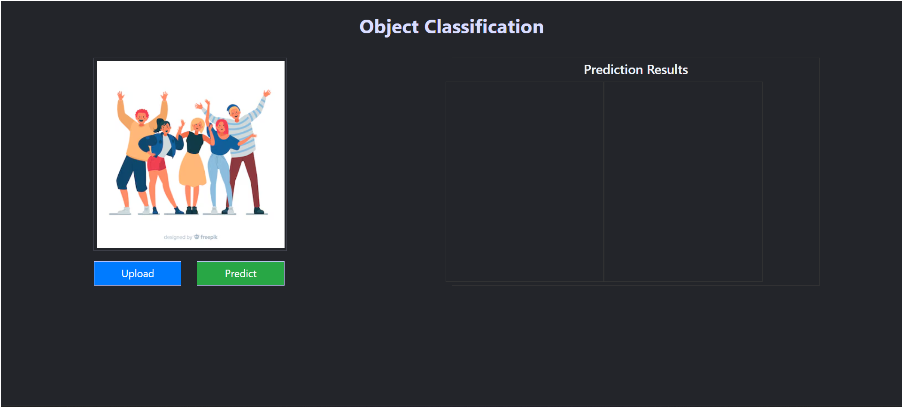

# CCC: AI‑Powered Chicken Coccidiosis Detection Chatbot

An end-to-end, AI-driven pipeline for automated detection and classification of chicken coccidiosis from images. By leveraging a modular training workflow, semantic image processing, and a real‑time Flask web interface, this system empowers poultry farmers and veterinarians with rapid, reliable diagnostic insights—anytime, anywhere.

---

## Here’s a preview of the app’s user interface:


---

## 🔧 Core Workflow

1. **Data Ingestion**  
   Managed via DVC, raw image datasets (microscopic slides, fecal smears) are downloaded, extracted, and split into training, validation, and test sets using `stage_01_data_ingestion.py`.

2. **Data Preprocessing**  
   Normalizes, augments, and transforms raw images into model-ready tensors within `stage_02_data_preprocessing.py`, ensuring robust performance under varied lighting and sample conditions.

3. **Model Training & Evaluation**  
   Trains a convolutional neural network using `stage_03_train_and_eval.py`, logs metrics (accuracy, precision, recall), and produces evaluation reports and saved model artifacts.

4. **Prediction Pipeline**  
   Loads the trained model in `chicken.pipeline.prediction_pipeline.PredictionPipeline`, decodes base64‑encoded uploads, and outputs classification results (e.g., “Infected” vs. “Healthy”).

5. **Real‑Time Flask API & UI**  
   - **Flask Backend** (`app.py`, `main.py`): Exposes `/predict`, `/train`, and `/` (UI) endpoints.  
   - **Templates** (`templates/index.html`): User-friendly upload interface.  
   - CORS‑enabled for integration with third‑party frontends or mobile apps.

---

## ✅ Key Capabilities

- **Image‑Grounded Diagnosis**  
  Delivers classification grounded in real microscopic images, pinpointing coccidial infections with high accuracy.  
- **Modular, Scalable Architecture**  
  Decoupled ingestion, preprocessing, training, and inference layers make extension and maintenance straightforward.  
- **Production‑Ready Best Practices**  
  - **DVC** for data and model versioning  
  - **Structured Logging** for pipeline transparency (`chicken.logger`)  
  - **Custom Exceptions** (`chicken.exception`) for robust error handling  
- **Containerized Deployment**  
  Dockerfile and `.dockerignore` ensure consistent environments and rapid scaling.  
- **Extensible ML Stack**  
  Swap in alternative model architectures or augment preprocessing steps with minimal code changes.

---

## 🐔 Disease Information

Chicken coccidiosis is a disease caused by a microscopic parasite that damages the intestines of chickens. It can lead to malnutrition, dehydration, and blood loss, and can be fatal.

### Symptoms  
- Diarrhea  
- Blood or mucus in feces  
- Depression, ruffled feathers  
- Pale skin, weight loss  

### Transmission  
- Oral–fecal route via infective oocysts in droppings  
- Contaminated litter, equipment, clothing, dust, or insects  

### Control & Prevention  
- Vaccination & preventative medication  
- Good management practices: litter hygiene, biosecurity  
- Disinfectants: steam cleaning, boiling water, 10% ammonia solution  
- Healthy birds develop immunity over time  

---

## 🚀 Deployment & CI/CD

- **GitHub Actions**  
  Automated DVC pulls, linting, testing, and Docker builds in `.github/workflows/`.
- **DVC**  
  Tracks and version‑controls datasets and model artifacts (`.dvc`, `dvc.yaml`, `dvc.lock`).
- **Docker**  
  Dockerfile Builds a slim‑based Python 3.11 image, installs dependencies, and sets `uv run app.py` as the entrypoint.
- **Azure Container Registry (ACR)**  
  Securely stores and manages your Docker images in Azure.
- **Azure Web App for Containers**  
  Deploys container images directly from ACR, offering auto‑scaling, built‑in load balancing, and fully managed hosting.

---

## Required Environment Variables
    ```bash
    DAGSHUB_USER_TOKEN=""
    ```

---

## 🏃 Running Locally

1. **Clone the repo**  
    ```bash
    git clone https://github.com/hasan-raza-01/CCC.git
    cd CCC
    ```
2. **Install dependencies**
   ```bash
   pip install --upgrade pip uv
   uv venv 
   .venv\scripts\activate
   uv pip install -e .
   ```
3. **Train the model**
    - ***Option A: Run full pipeline***
    ```
    uv run main.py
    ```
    - ***Option B: Trigger via Flask endpoint or navigate to the endpoint***
    #### only run when app is up or it will throws error
    ```bash 
    curl http://localhost:8080/train
    ```
4. **Start the API & UI**
    - ***Run Locally***
    ```bash 
    uv run app.py
    ```
    - ***Run Using Docker***
    ```bash 
    docker build -t ccc-detector:latest .
    docker run -p 8080:8080 ccc-detector:latest
    ```
5. **Interact via browser** 
    - Navigate to http://localhost:8080/ to upload images and view predictions.

---

## 📂 Repository Structure 
``` 
.
├── .dvc/                          # DVC configuration for data/model versioning
├── .github/workflows/             # CI/CD pipelines
├── src/
│   └── chicken/
│       ├── configuration.py       # Pipeline configs
│       ├── components/            # Data ingestion/preprocessing/training modules
│       ├── exception.py           # Custom exception classes
│       ├── logger.py              # Logging setup
│       ├── pipeline/              # Training & prediction pipelines
│       └── utils/                 # Image decoding, helpers
├── templates/                     # Flask HTML templates
├── Dockerfile                     # Containerization spec
├── dvc.yaml                       # Pipeline stages definition
├── dvc.lock                       # Locked version of DVC stages
├── requirements.txt               # Python dependencies
├── setup.py                       # Package configuration
├── app.py                         # Flask application entrypoint
└── main.py                        # Orchestrates data ingestion, preprocessing, training
```
